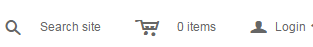

# Shopify-Alert-Cart
Highlight your Shopify cart when it has an item in it

Shoppers may abandon their carts <a href="https://www.shopify.com/blog/51360261-4-checkout-conversion-killers-that-drive-your-buyers-away">if they forget they added anything to them</a>. 
Easily call attention to your cart when your users add products to it. 
This Liquid code is a Java/jQuery-free, CSS-only solutuion.

<strong>Empty cart</strong> 

<strong>No alert class</strong> 

<strong>With alert class</strong> 

